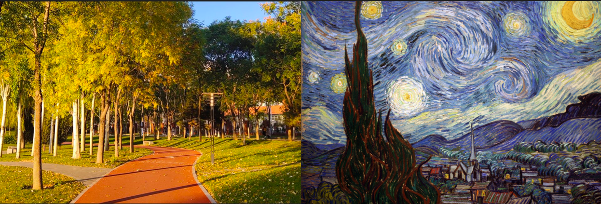
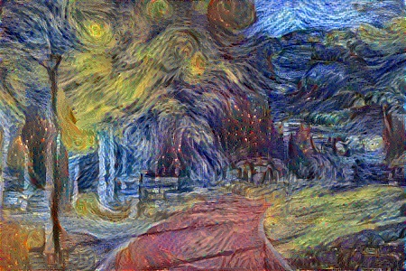

# style-transfer
This is a style transfer project using Tensorflow2.X. The backbone network used is vgg19. Great for introductory learning.

You should first install the environment using the following command.

```python
conda install tensorflow-gpu
pip intall tqdm
```


OK! Let's start run **main.py**

Of course you can edit the settings in **main.py** , like image paths etc.

```python
###config start###
CONTENT_LAYERS = {'block4_conv2': 0.5, 'block5_conv2': 0.5} #内容特征层及loss加权系数
STYLE_LAYERS = {'block1_conv1': 0.2, 'block2_conv1': 0.2, 'block3_conv1': 0.2, 'block4_conv1': 0.2,
                'block5_conv1': 0.2}                        #风格特征层及loss加权系数

CONTENT_IMAGE_PATH = './data/content.jpg'          #内容图片路径
STYLE_IMAGE_PATH = './data/style.jpg'              #风格图片路径
OUTPUT_DIR = './output'                            #生成图片的保存目录

CONTENT_LOSS_FACTOR = 1      #内容loss总加权系数
STYLE_LOSS_FACTOR = 100      #风格loss总加权系数

WIDTH = 450                  #图片宽度
HEIGHT = 300                 #图片高度

EPOCHS = 20                  #训练epoch数
STEPS_PER_EPOCH = 100        #每个epoch训练多少次
LEARNING_RATE = 0.03         #学习率
### config end ###
```


Then you can get the image after style transfer in the folder **OUTPUT_DIR**! This is very simple and clear. Of course you can also improve on this using different images, different parameters, or even different migration methods




